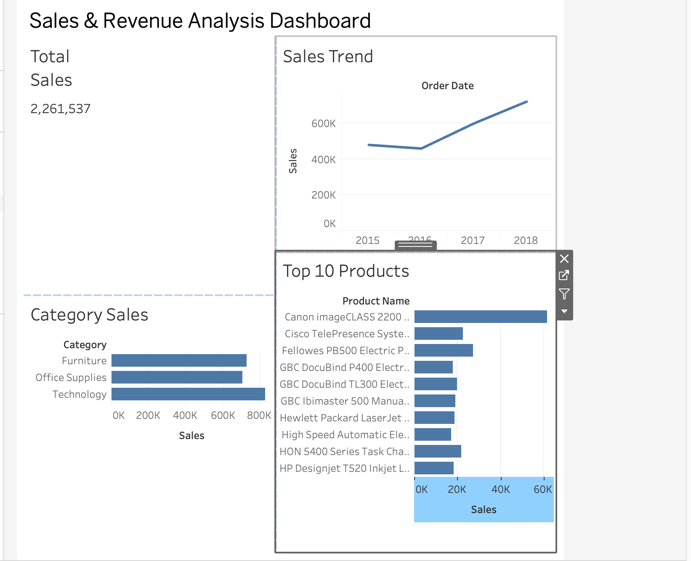

# Sales & Revenue Analysis Dashboard

This project presents an interactive Sales & Revenue Analysis Dashboard built using Tableau Public.

## Features
- Total Sales Overview
- Year-wise Sales Trend
- Category-wise Sales Analysis
- Top 10 Products by Sales

## Tools Used
- Tableau Public
- CSV Dataset
- GitHub

## Dashboard Preview

## Tools & Technologies

- Tableau Public
- GitHub
- CSV Dataset
- Data Visualization
- Business Intelligence (BI)

## Dataset

- Superstore Sales Dataset

## Key Insights

- Total Sales: 2,261,537
- Year-wise Sales Trend
- Category-wise Sales Comparison
- Top 10 Best Selling Products

## Dashboard Preview

